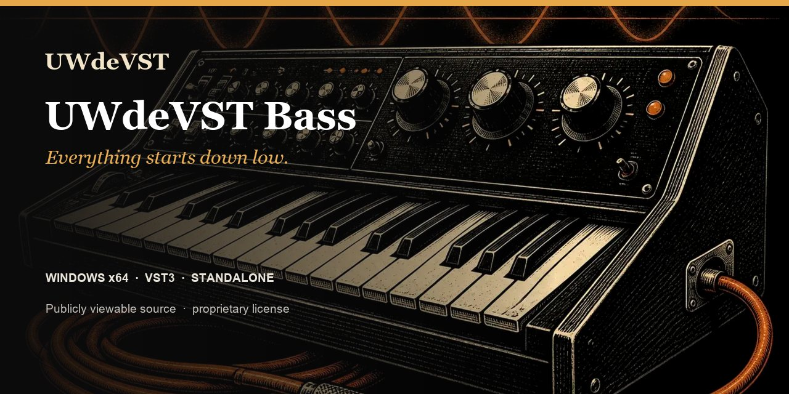

# UWdeVST Bass

**Tout commence dans les graves.** Neuf modèles pour donner de l’assise, du rebond et du caractère à vos lignes de basse.

**Windows x64 · Linux x86_64 · VST3 · Application autonome · 1.0.2**

[Windows ZIP](https://github.com/unicornwhodev/uwdevst-piano-bass-guitar/releases/download/bass-v1.0.2/synth-bass_1.0.2_Windows_x64.zip) · [Linux TAR.GZ](https://github.com/unicornwhodev/uwdevst-piano-bass-guitar/releases/download/bass-v1.0.2/UWdeVST_Bass_1.0.2_Linux_x86_64.tar.gz) · [macOS builder](TELECHARGEMENTS.md#macos) · [Tous les instruments](../README.md)

- 9 modèles dans 3 familles
- 18 presets d’usine et une collection de presets XML
- Réglages de brillance, enveloppe, filtre et drive
- Son produit par synthèse, sans bibliothèque d’échantillons

## Choisir sa basse

| Famille | Modèles | Idées de jeu |
| --- | --- | --- |
| Acoustique | Contrebasse, Basse Fingered, Basse Slap | Lignes jouées, notes détachées et attaques de cordes. |
| 808 | Sub 808, Boom 808, Distorted 808 | Graves profonds, notes tenues et accents électroniques. |
| Synth | Moog Bass, Reese Bass, Acid Bass | Basses de synthèse, mouvement de filtre et motifs répétitifs. |

## Jouer

Commencez par un preset Reference et une courte ligne dans le registre grave. Ajustez l’attaque et le relâchement pour l’articuler avec le rythme, puis le corps et le filtre pour lui trouver une place dans le mix.

L’application autonome permet de jouer directement avec un clavier MIDI. Le VST3 s’utilise sur une piste instrument de votre logiciel de musique. [Installer Bass](INSTALLATION.md).

## Version disponible

Les distributions **1.0.2** sont disponibles ci-dessus. Bass est un instrument mis en avant à la suite de l’acceptation humaine des versions auditionnées. [Versions et statut d’écoute](VERSIONS.md).

[Piano](PIANO.md) · [Guitar](GUITAR.md) · [Licence](LICENCE.md) · [Support](https://github.com/unicornwhodev/uwdevst-piano-bass-guitar/issues/new/choose)
