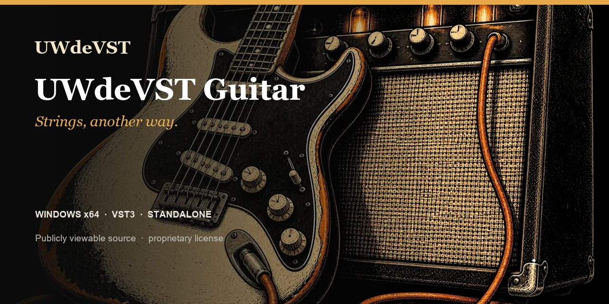

# UWdeVST Guitar

**Strings, another way.** Nine models for riffs, accompaniment and guitar textures.

**Windows x64 · Linux x86_64 · VST3 · Standalone · 1.0.2**

[Windows ZIP](https://github.com/unicornwhodev/uwdevst-piano-bass-guitar/releases/download/guitar-v1.0.2/synth-guitar_1.0.2_Windows_x64.zip) · [Linux TAR.GZ](https://github.com/unicornwhodev/uwdevst-piano-bass-guitar/releases/download/guitar-v1.0.2/UWdeVST_Guitar_1.0.2_Linux_x86_64.tar.gz) · [macOS builder](DOWNLOADS.md#macos) · [All instruments](../README.md)

- 9 models in 3 families
- Reference and Signature factory presets
- Attack, brightness, body and spatial controls
- Sound generated by synthesis, with no sample library to install

## Choose your guitar

| Family | Models | Ideas to play |
| --- | --- | --- |
| Acoustic | Folk Steel, 12-String, Flamenca | Accompaniment, arpeggios and plucked-string phrases. |
| Electric | Clean, Crunch, Lead | Riffs, rhythmic parts and electric melodies. |
| Electronic | Synth Guitar, E-Guitar Pad, Guitar Ambient | Pads, textures and synthesized colours. |

## Play it

Choose a family, then a Reference preset to start with the instrument character or Signature to explore a different colour. Play a short phrase, compare velocity responses and shape the attack before adding space with the effects.

Use the Standalone application with a MIDI keyboard, or add the VST3 to an instrument track in your music software. [Install Guitar](INSTALLATION.md).

## Available version

The official **1.0.2** distributions are available above. Guitar is featured following human listening approval of the auditioned versions. [Versions and listening status](VERSIONS.md).

[Piano](PIANO.md) · [Bass](BASS.md) · [Licence](LICENSING.md) · [Support](https://github.com/unicornwhodev/uwdevst-piano-bass-guitar/issues/new/choose)
