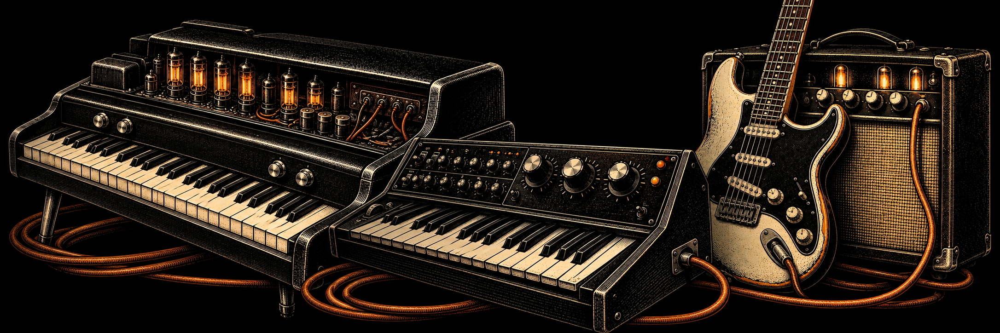

# Choose an instrument

**Three instruments, 26 models.** Choose a role in your track, then explore the product guide.

| Musical idea | Instrument |
| --- | --- |
| Play chords, write a melody or find an electric keyboard colour | [Piano — 8 keyboards](PIANO.md) |
| Write a bass line, shape electronic low end or choose an 808 | [Bass — 9 models](BASS.md) |
| Build a riff, accompaniment or string texture | [Guitar — 9 models](GUITAR.md) |

Each synthesizer has its own Standalone application and VST3 plug-in. Use them independently or on three tracks in the same project. Sound is generated by synthesis, with no sample library to install.

## Add effects

[UWdeVST · Musique FX](https://github.com/unicornwhodev/uwdevst-fx) brings eleven effects for tone, dynamics, space and movement.

[Downloads](DOWNLOADS.md) · [Installation](INSTALLATION.md) · [Versions](VERSIONS.md) · [Collection home](../README.md)
